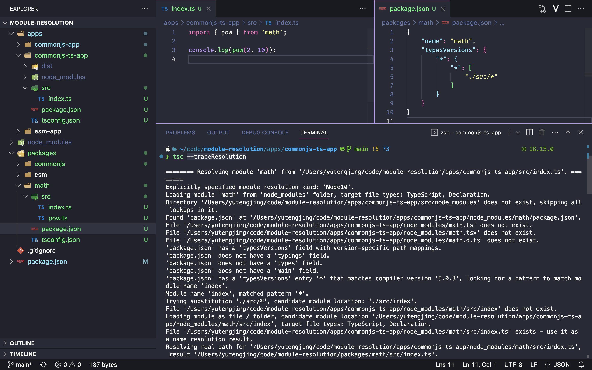

模块化之争的在 ESM 标准出来的时候已成为定局，这两年前端界也在进行 ESM 大迁移。关于 ESM 个人感觉可以聊的并不多，最近讨论最多的可能还是到底该不该用 default import 以及它俩互相转换的各种坑。前不久 TS 发布了 5.0，引入了新的 moduleResolution：`bundler`。官方文档对此的描述非常简单，但是引进它带来的最大优势其实是：你可以不写扩展名的同时，使用 package.json exports 的来处理 typescript 类型。估计是考虑到展开来讲的需要讲述大量背景，文档就没提。本文就总结一下我所知道的关于模块解析策略的方方面面。

## 什么是 moduleResolution

当我们讨论**模块化标准**（对应的英文术语 `module`），我们更多的是讨论一个模块是如何声明使用导入导出的语法。具体来说：

- commonjs 使用 require 来导入，exports.xxx 来导出
- esm 使用 import/export

而**模块解析策略**（ moduleResolution）更多描述的是一个模块包括相对路径以及非相对路径（也就是第三方库，亦或者说 npm 包）是按照怎样的规则去查找的。相对路径没什么复杂的，本文不做讨论，主要聊聊第三方库的解析。

我们最熟悉的模块解析策略其实是 nodejs 的模块解析策略。第一次了解到还有别的模块解析策略还是在我刚学习 typescript 的时候，模块解析策略可以使用 tsconfig.json 的 moduleResolution 选项来配置，最早只支持两个值：classic 和 node。node 策略在 typescript 中又称之为 node10 的解析策略，随着 nodejs 对模块解析策略的更新，后面又新增了 node16 和 nodeNext，nodeNext 其实和 ESNext 一样表示 nodejs 最新的解析策略。node16 主要是增加了 ESM 相关的一些限制，例如模块必须写扩展名。

### moduleResolution: classic

> You can use the [`moduleResolution`](https://www.typescriptlang.org/tsconfig#moduleResolution) option to specify the module resolution strategy. If not specified, the default is [Node](https://www.typescriptlang.org/docs/handbook/module-resolution.html#node) for `--module commonjs`, and [Classic](https://www.typescriptlang.org/docs/handbook/module-resolution.html#classic) otherwise (including when [`module`](https://www.typescriptlang.org/tsconfig#module) is set to `amd`, `system`, `umd`, `es2015`, `esnext`, etc.).

上面这段引自 typescript [官方文档](https://www.typescriptlang.org/docs/handbook/module-resolution.html#module-resolution-strategies)，从 ts 的文档来看 amd 模块化标准貌似用的就是 classic 解析策略。其实这才是普通人最容易想到的最正常的模块解析策略，对于下面这个导入第三方依赖 `moduleB` 的代码：

```typescript
// 文件：/root/src/folder/A.js
import { b } from 'moduleB';
```

会经历下面的步骤来查找 `moduleB`:

1. `/root/src/folder/moduleB.js`
2. `/root/src/moduleB.js`
3. `/root/moduleB.js`
4. `/moduleB.js`

简单来说这种模块解析策略就是一直递归往上找同名文件，当前目录找不到同名文件就往父级目录找。不过这种策略目前前端界用得不多。
文档中也提到了说 tsconfig.json 中的 `moduleResolution` 属性在其它一些属性被调整的情况下会自动切换，例如我们看 [nestjs 的 tsconfig.json](https://github.com/nestjs/nest/blob/master/packages/tsconfig.build.json)：

```json
{
  "compilerOptions": {
    "composite": true,
    "module": "commonjs",
    "declaration": true,
    "noImplicitAny": false,
    "skipLibCheck": true,
    "suppressImplicitAnyIndexErrors": true,
    "noUnusedLocals": false,
    "importHelpers": true,
    "removeComments": false,
    "noLib": false,
    "emitDecoratorMetadata": true,
    "experimentalDecorators": true,
    "useUnknownInCatchVariables": false,
    "target": "es2017",
    "sourceMap": false,
    "allowJs": false,
    "strict": true,
    "strictNullChecks": false,
    "types": ["node"]
  }
}
```

它并没有声明 `moduleResolution` 字段，但是由于 `module` 被声明为了 `commonjs`，因此 `moduleResolution` 被自动调整为了 `node`。

### moduleResolution: node

写过 nodejs 的人应当非常熟悉了这个模块解析策略了，这个模块解析策略其实就是 nodejs 解析模块的策略，其实也就是 node 中的 `require.resolve` 实现。这也是各种前端构建工具如 webpack, vite 所采用的模块解析策略，这里没说 rollup 是因为 rollup 默认没有内置模块解析策略。rollup 默认所有 npm 包都是 external 的，你需要使用 node 模块解析策略的插件：[@rollup/plugin-node-resolve](https://github.com/rollup/plugins/tree/master/packages/node-resolve)。虽然我是说 vite 用的 nodejs 模块解析策略，但 vite 的实现并不完全和 nodejs 一致，其它工具也一样。标准是标准，至于实现不一定就符合标准，具体我们后面展开说。

很多前端工具的 node 模块解析策略都不太一样：

- vite 用的是第三方库 [resolve.exports](https://github.com/lukeed/resolve.exports)
- rollup 在 [@rollup/plugin-node-resolve](https://github.com/rollup/plugins/tree/master/packages/node-resolve) 自己实现的
- webpack 用的 [enhanced-resolve](https://www.npmjs.com/package/enhanced-resolve)
- 不过还是 ljharb 大佬的 [resolve](https://www.npmjs.com/package/resolve) 下载量最高，但是不支持 exports

其实也有框架想通过优化这个解析速度来优化构建速度的，例如 rspack 用的 rust 模块 [nodejs_resolver](https://github.com/web-infra-dev/nodejs_resolver)，毕竟查找模块是构建过程的高频操作了，基本上每个文件都需要解析 imports，而 nodejs 的模块解析规则又那么复杂。

完整的 nodejs 解析策略可以看 node 的官方文档：[module#all-together](https://nodejs.org/api/modules.html#all-together)。

对于下面这段 nodejs 代码：

```javascript
// 文件 /root/src/moduleA.js
var x = require('moduleB');
```

会按照下面的步骤来查找 `moduleB`：

1. 同级目录的 node_modules 找同名的 js 文件， `/root/src/node_modules/moduleB.js`

2. 同级目录 node_modules 里面找包含 package.json 的名为 `moduleB` 文件夹：`/root/src/node_modules/moduleB/package.json`

3. 同级目录 node_modules 里面找包含 `index.js` 的 moduleB 文件夹 `/root/src/node_modules/moduleB/index.js`

还是找不到的话，那就往上一级目录重复前面的查找步骤

4. `/root/node_modules/moduleB.js`

5. `/root/node_modules/moduleB/package.json`

6. `/root/node_modules/moduleB/index.js`

其实上面的过程主要对应 nodejs 官方文档中的下面这段，不过要读懂官方文档还是需要一定的背景知识，有经验的读者还是建议仔细阅读一下的。

```javascript
LOAD_NODE_MODULES(X, START)
1. let DIRS = NODE_MODULES_PATHS(START)
2. for each DIR in DIRS:
   a. LOAD_PACKAGE_EXPORTS(X, DIR)
   b. LOAD_AS_FILE(DIR/X)
   c. LOAD_AS_DIRECTORY(DIR/X)

NODE_MODULES_PATHS(START)
1. let PARTS = path split(START)
2. let I = count of PARTS - 1
3. let DIRS = []
4. while I >= 0,
   a. if PARTS[I] = "node_modules" CONTINUE
   b. DIR = path join(PARTS[0 .. I] + "node_modules")
   c. DIRS = DIR + DIRS
   d. let I = I - 1
5. return DIRS + GLOBAL_FOLDERS
```

相比于 classic 的区别在于：

- 查找的目录是 node_modules，不是父级文件夹

- 引入了 package.json，package.json 中各种配置项尤其是后面会展开说的 `exports` 字段使得 node 模块解析策略的变得非常复杂

- 支持文件夹模块，也就是 moduleB/index.js，文件夹中包含 index.js，这个文件夹就是一个模块。

其它需要注意的点：

- 查找的文件类型不重要。css, png，html, wasm 文件都可以视为一个模块。
- 在工具中查找模块也不重要。 tsc, nodejs, vite, esbuild, webpack, rspack 都需要查找模块都需要处理 import/require，都需要解析模块，都需要选择一个查找模块的策略。
- node 的模块解析策略本身是不断变化的。例如说早期的 node 并不支持 package.json 的 exports 字段
- node 使用 cjs 或者 esm 下 moduleResolution 也是有区别的：esm 下文件模块必须有后缀名。

### 追踪模块解析

#### nodejs

当然最准确的还是看 nodejs 源码，debug nodejs 源码。觉得麻烦我们可以退而求其次 debug 一个实现 nodejs 解析策略的 npm package：

- [resolve.exports](https://github.com/lukeed/resolve.exports)
- [@rollup/plugin-node-resolve](https://github.com/rollup/plugins/tree/master/packages/node-resolve)
- [enhanced-resolve](https://www.npmjs.com/package/enhanced-resolve)
- [resolve](https://www.npmjs.com/package/resolve)

#### typescript

tsc 有一个参数 `--traceResolution` 可以用来调试 tsc 查找 ts 文件的步骤。nodejs 没有找到类似的工具，有机会我来自己手动实现一遍 node 的解析策略，并输出每一步它在查找什么。tsc 虽然用的是 node 的解析策略，但是它还是有它自己的一些特殊性的，例如 ts 支持 node_modules/types 目录，package.json 支持 `types`, `typings`, `typesVersions` 等字段。



## 模块主入口

package.json 是前端工具绕不开的东西，很多前端工具都支持通过 package.json 来写配置。而在 node_modules 下，一个包含 package.json 的文件夹可以视为一个模块，我们可以通过 package.json 来定义这个模块在被另一个模块导入时的解析规则。

### main 字段

通过 main 字段来定义一个模块如何导出是目前最常见的做法了。拿全球下载量第一的 npm 包 lodash 来举例，[它的 package.json](https://npmview.vercel.app/lodash) 简化一下是这样的：

```json
{
  "name": "lodash",
  "version": "4.17.21",
  "main": "lodash.js"
}
```

当没有其它字段时，node 在解析不含子路径的模块时就会找到 main 字段对应的文件。

那如果模块包含子路径时会怎样处理呢？例如：

```javascript
const add = require('lodash/add');
```

nodejs 会直接查找 `node_modules/lodash/add.js`，也就是说查找模块子路径非常简单粗暴。但如果你的项目不是像 lodash 那样把所有源码平铺到 `package.json` 同级，只使用 `main` 字段的情况下就没办法通过 `lodash/add` 来引用了。例如你把所有源码都丢到 `src` 目录，那你使用的时候就要写成：

```javascript
const add = require('lodash/src/add');
```

这也解释了我一直以来的一个困惑：为啥 lodash 要把所有源码平铺到 package.json 同级，导致 github 主页一打开就很长，找 package.json 也找半天，很不方便。原因我想就是为了方便导入子路径。

### module 字段

为了解决某些库想同时提供 cjs 和 esm 两份 js 代码，我们可以使用 module 字段来置顶 esm 版本的入口。例如 [redux](https://npmview.vercel.app/redux)，简化后的 package.json：

```json
{
  "name": "redux",
  "version": "4.2.1",
  "main": "lib/redux.js",
  "unpkg": "dist/redux.js",
  "module": "es/redux.js",
  "typings": "./index.d.ts",
  "files": ["dist", "lib", "es", "src", "index.d.ts"]
}
```

类似的字段还有很多，像上面写到的：

- typings，和 types 是一样的作用，用来给 tsc 说明模块的类型声明入口。它俩更建议用 typings，首先 types 和另一个字段 type 很接近，容易拼错。另外，我们 ts 项目里面存放 .d.ts 一般也放 typings 目录，ts-node 查找 .d.ts 也只找 typings 目录。
- unpkg 和 jsdeliver, cdn, browser 字段一样都是给 cdn 厂家用的，细节可以参考这个 issue: [[What about `cdn` entry?](https://github.com/stereobooster/package.json/issues/14#top)](https://github.com/stereobooster/package.json/issues/14)

### vite 如何选择模块入口

构建工具如 webpack, vite 都不会去搭理 typings, 以及一堆 cdn 厂家的私有字段。

当同时存在 `main` 和 `module`入口，各种构建工具尤其是 rollup, vite 这些基于 ESM 的都是优先使用 module 字段。那如果只有 1 个 main 字段，使用 vite 会发生啥呢？

首先 vite 打包情况分很多种：

- pre bundling: 使用 esm 预构建
- esm dev server: vite 内置插件 `vite:resolve`
- prod build: 生产环境构建，rollup + `vite:resolve` 插件 + `@rollup/plugin-commonjs` 插件
- worker: iife 格式

默认情况下，vite 预构建不管你第三方依赖支不支持 esm，都会给你打包。你不想预构建，就得手动将依赖添加到预构建 exclude 列表。当把一个依赖添加到预构建 exclude 列表，vite 就不会对它进行 commonjs -> esm 转换，也就是说你把 main 字段指向 commonjs 块，vite 就会傻傻的把那个模块当 esm 模块处理。

生产环境构建其实和用 rollup + `@rollup/plugin-node-resolve` + `@rollup/plugin-commonjs` 差不多，都是经历下面步骤：

- `vite:resolve` 插件解析到 main 指向的文件 `xxx.js`
- `@rollup/plugin-commonjs` 根据 `xxx.js` 的后缀名或者源代码识别是否是非 esm 模块，例如后缀名是 `.cjs`，再例如源码发现不是 cjs 模块直接不处理。确定是 cjs 模块就会给你转换，具体可以看源码：<https://github.com/rollup/plugins/blob/master/packages/commonjs/src/index.js。>

vite 和 rollup 都是通过插件系统来增加自身的能力，它们都是先通过 resolve 插件确定一个模块的最终文件路径，再下一步使用 `@rollup/plugin-commonjs` 插件在需要转换的情况下给你转成 esm。同时存在 esm 的入口和通用入口，都会优先使用 esm 入口。

什么叫通用入口？一些人可能会认为 main 入口是给 commonjs 专用的，其实不是，main 入口也可以给 esm 用，它是一个通用入口。另一个类似的还有 exports 中的 default 字段。

```json
{
  "exports": {
    ".": {
      "import": {
        "development": "./src",
        "import": "./dist/es/index.mjs",
        "require": "./dist/cjs/index.cjs",
        "default": "./dist/es/index.mjs"
      }
    }
  }
}
```

### typesVersions

2023 年了，typescript 已然成为前端 er 的标配，即便你写的是 js，也能通过 jsdoc 充分感受的 ts 的强大和魅力。曾在知乎上看到有人吐槽说 ts 的类型系统过于复杂，其实我觉得复杂其实是强大和灵活必然带来的。对于 ts，我现在最感到沮丧的反倒是它的性能，也不是说 tsc 构建性能，tsc 现在每个月还在投入精力优化的构建模式我也不是很感兴趣。我更希望优化的是编辑器代码提示的速度，稍微大点的项目有时能卡上好几秒才出提示，没体会什么叫慢，可以试试在 VSCode 打开这个项目 <https://github.com/nicoespeon/abracadabra>，sematic token 速度不尽人意，结合 volar 插件，写 vue 时经常肉眼可见一个变量从普通文本变成变量。最近一个消息挺有意思的，svelte 据说下一个大版本要从 ts 全面切回 js...

由于 ts 的流行，发布 npm 包的类型声明文件自然也成为了一个问题。目前主要有两种形式：

- 发布 types 包到 <https://github.com/DefinitelyTyped/DefinitelyTyped，目前有> 8000+ 包采用这个方式
- 发布源码包的时候自带类型文件

使用 pnpm 安装依赖的时候有时候会看到这个警告：

```shell
 WARN  deprecated @types/markdownlint@0.18.0: This is a stub types definition. markdownlint provides its own type definitions, so you do not need this installed.
```

其实就是说这个 `markdownlint` 已经自己带了类型声明文件，你不用手动安装 `@types/markdownlint` 了。

我们可以观察一下它的 package.json 看看它是如何通知包管理器去做出这个提示的：

```json
{
  "name": "@types/markdownlint",
  "version": "0.18.0",
  "typings": null,
  "description": "Stub TypeScript definitions entry for markdownlint, which provides its own types definitions",
  "main": "",
  "scripts": {},
  "author": "",
  "repository": "https://github.com/DavidAnson/markdownlint",
  "license": "MIT",
  "dependencies": {
    "markdownlint": "*"
  }
}
```

如何废弃一个 types 包，可以看官方文档：<https://github.com/DefinitelyTyped/DefinitelyTyped#removing-a-package>, 但 pnpm 是依据什么判断做出这个提示的我猜可能是根据一个 types 包 @types/xxx 有没有 xxx 在 dependencies 中。

当我们发布一个 npm 包并且想要把类型声明文件一起发布的时候，一般情况下我们使用 typings 字段指向我们入口类型文件即可，例如 [moment](https://npmview.vercel.app/moment)：

```json
{
  "name": "moment",
  "version": "2.29.4",
  "main": "./moment.js",
  "typings": "./moment.d.ts",
  "typesVersions": {
    ">=3.1": {
      "*": ["ts3.1-typings/*"]
    }
  }
}
```

如果你类型声明文件名字就叫 `index.d.ts`，那你 package.json 啥也不用配置，例如 [axios](https://npmview.vercel.app/axios) 就是这样。因为 tsc 查找类型文件时其中一个途径就是 node_module/xxx/index.d.ts。

#### 子路径导出类型声明

当你想你的模块支持子路径导出，问题就变得复杂起来了。如果你选择使用 types 包发布类型声明，那问题倒简单，你只需要像 [@types/lodash](https://npmview.vercel.app/@types/lodash) 那样将类型声明文件按照导入的路径一样组织目录即可。具体来说你导入语句是：

```javascript
import add from 'lodash/add';
```

就需要存在 `node_modules/@types/lodash/add.d.ts` 这样的文件。如果你是像 `node_modules/@types/lodash/src/add.d.ts` 这样组织，把代码都放到 src 目录下，tsc 肯定是找不到的。

使用 types 包的形式发布，把类型声明都平铺到 package.json 同级，倒没什么维护上的问题。但如果你是选择类型声明和源码一起捆绑发布，还采用这种方式，把源码和类型声明混在一起，维护起来便会相当难受。

我们来看看 [unplugin-auto-import](https://npmview.vercel.app/unplugin-auto-import) 是怎样做的，首先它的目录结构是这样：

```txt
.
├── LICENSE
├── README.md
├── auto-imports.d.ts
├── dist
│   ├── astro.d.ts
│   ├── esbuild.d.ts
│   ├── index.d.ts
│   ├── nuxt.d.ts
│   ├── rollup.d.ts
│   ├── types.d.ts
│   ├── vite.d.ts
│   ├── webpack.d.ts
└── package.json
```

可以看到它的类型声明文件没有平铺到 package.json 同级，那么问题就是怎样把类型声明从 `unplugin-auto-import/vite` 重定向到 `unplugin-auto-import/dist/vite.d.ts` 了。这就用到了 `typesVersions` 字段：

```json
{
  "name": "unplugin-auto-import",
  "version": "0.15.2",
  "types": "dist/index.d.ts",
  "typesVersions": {
    "*": {
      "*": ["./dist/*"]
    }
  }
}
```

外层的 `*` 表示版本范围是任意版本，内层的 `*` 表示任意子路径，例如 `unplugin-auto-import/vite` 就对应 `vite`，整体表示查找任意版本的 `unplugin-auto-import` 的类型时，将查找路径重定向到 dist 目录。更详细的解释可以看官方文档：[Version selection with`typesVersions`](https://www.typescriptlang.org/docs/handbook/declaration-files/publishing.html#version-selection-with-typesversions)。

## exports

如果说 ESM 是模块化标准的最终解决方案，那么 package.json 的 exports 便是 moduleResolution 的最终解决方案。nodejs 官方文档[Modules: Packages](https://nodejs.org/dist/latest-v18.x/docs/api/packages.html) 章节其实大部分内容主要就是在讲 exports。首先我们先简单介绍一下 exports 的用法。

### 主入口导出

首先 exports 中所有的路径都必须以 `.` 开头，可以把 `.` 简单理解为就是模块名。类似 `main` 和 `module` 字段，我们可以使用下面的写法来配置一个模块没有写子路径时怎样导出的，也叫主入口：

```json
{
  "name": "xxx",
  "exports": {
    ".": "./index.js"
  }
}
```

更简化的写法，上面配置的语法糖：

```json
{
  "name": "xxx",
  "exports": "./index.js"
}
```

例如 `import x from 'xxx'` 其实会被解析到 `node_modules/xxx/index.js`

### 子路径导出

你可以像下面这样定义子路径模块的映射规则：

```json
{
  "exports": {
    "./submodule.js": "./src/submodule.js"
  }
}
```

没有声明的子路径不能使用：

```javascript
// Loads ./node_modules/es-module-package/src/submodule.js
import submodule from 'es-module-package/submodule.js';

// Throws ERR_PACKAGE_PATH_NOT_EXPORTED
import submodule from 'es-module-package/private-module.js';
```

### 导出多个子路径

#### 基本用法

例如我们重构 lodash，把所有的子路径模块，也就是 package.json 同级的的那一堆 js 模块放到 lib 文件夹。一种选择就是声明所有子路径：

```json
{
  "name": "lodash",
  "exports": {
    "./add": "./lib/add.js",
    "./multiply": "./lib/multiply.js",
    "...": "..."
  }
}
```

但是这样会导致 package.json 非常臃肿，通过在子路径中使用通配符可以处理任意的嵌套子路径：

```json
{
  "name": "lodash",
  "exports": {
    "./*": "./lib/*.js"
  }
}
```

注意我们这里的 `*` 用的不是 glob 语法，要读懂这个映射规则，我们可以这样理解：

1. 给定一个导入语句 `lodash/add`
2. 将 `lodash/add` 和映射的 key，也就是左侧的 pattern `./*` 做模式匹配，这样 `*` 的值就是 `add`。
3. 将将右侧的 pattern 中的 `*` 替换第二步得到的 `*` 的值

#### 扩展名和文件夹模块问题

需要注意的是 node 在上述步骤中是不会做自动添加扩展名的操作，例如你写成下面这样是有问题的：

```json
{
  "name": "lodash",
  "exports": {
    "./*": "./lib/*"
  }
}
```

根据上面的配置 `lodash/add` 对应到的就是 `node_modules/lodash/add`，首先在 nodejs esm 条件下，由于模块必须带扩展名，它显然是有问题的。有些人可能认为在 cjs 下它就能正常工作了，事实上也是不能工作的。exports 配置的映射规则已经到底了，不会处理扩展名，而且也不会处理文件夹模块，它是直接把 `node_modules/lodash/add` 当成没有扩展名的 js 文件模块处理的。

也就是说下面这样的目录结构是不会正常工作的：

```txt
.
├── add
│   └── index.js
├── add.js
├── index.js
└── package.json
```

下面这样的目录结构反倒是正常工作的，其中 add 是一个没有 `.js` 扩展名的 js 代码文件。

```txt
.
├── add
├── index.js
└── package.json
```

如果你要处理文件夹模块，例如有一个组件库，需要将 `ui/xxx` 解析到 `node_modules/ui/dist/xxx/index.js`，那就需要写成：

```json
{
  "name": "ui",
  "exports": {
    "./*": "./dist/xxx/index.js"
  }
}
```

#### 优先级

如果 exports 映射左侧的多个 pattern 都能匹配当前导入模块，最终会选择哪个呢?

当 package.json 为：

```json
{
  "name": "xxx",
  "export": {
    "./*": "./*",
    "./a/*": "./a/*.js",
    "./a/b": "./a/b.js",
    "./*.js": "./*.js"
  }
}
```

模块 id 是：`xxx/a/b`，最终会使用最具体的 `./a/b`。

`./*`, `./a/*`, `./a/b` 都能匹配这个模块 id，显然短路匹配时是不合理的，因为如果采用短路匹配，那么就是采用 `./*` 这个规则了，我们就没办法去设置一个更具体的规则，也就是说 `./a/b` 这个规则就没用了。

再看另一个例子：

package.json:

```json
{
  "name": "xxx",
  "exports": {
    "./*": null,
    "./a/*/c": null,
    "./a/b/*": "./dist/hello.js"
  }
}
```

当模块 id 是 `xxx/a/b/c`，nodejs 会采用 `"./a/b/*"`，而目前主流的几个 node 模块解析库都不能正确解析，只有 webpack 用的 [enhanced-resolve](https://github.com/webpack/enhanced-resolve) 是可以解析的，下面三全跪：

- vite 内置插件 `vite:resolve` 使用的 [resolve.exports](https://github.com/lukeed/resolve.exports/issues/29) 这个第三方库
- rollup 官方插件 [@rollup/plugin-node-resolve](https://github.com/rollup/plugins/issues/1476)
- rspack 使用的 [nodejs-resolver](https://github.com/web-infra-dev/nodejs_resolver/issues/177)

虽然 enhanced-resolve 可以处理上面给出的用例，但是它却处理不了下面这个例子：

```json
{
  "name": "xxx",
  "exports": {
    "./*/c": "./dist/hello.js"
  }
}
```

对于这个例子它的结果是 undefined, 但是 node 是可以正确解析到 `./dist/hello.js` 这个 target。可见 nodejs 的模块解析策略之复杂远超常人想象，以至于主流的解析库在处理一些特殊情况都或多或少有些 bug，尤其是在处理优先级的时候。

那么所谓的更具体到底是怎样的算法呢？参考 [enhanced-resolve 的源码](https://github.com/webpack/enhanced-resolve/blob/main/lib/util/entrypoints.js#L565) ，我们可以这样做：

1. 首先遍历所有 pattern，筛选出和模块 id 可以匹配的 pattern。在我们之前的例子就是 `./*`, `/a/*/c`, `./a/b/*`
2. 将所有 pattern 构造一颗树
3. 采用层级遍历顺序，优先取当前层非通配符的节点。在第二层把 `./*` pass 掉了
4. 最终遍历到叶子节点的这条路径表示的 pattern 就是最特殊的 pattern，也就是 `./a/b/*`

```txt
      root
    a      *
  b   *
*       c
```

### 条件导出

为了能够在不同条件下采用不同的 exports 映射规则，你可以使用条件导出。

```json
{
  "exports": {
    ".": {
      "node-addons": "./c-plus-native.node",
      "node": "./can-be-esm-or-cjs.js",
      "import": "./index-module.mjs",
      "require": "./index-require.cjs",
      "default": "./fallback-to-this-pattern.js"
    }
  }
}
```

上面这个例子演示的是 nodejs 内置支持的条件，导入模块 `xxx`：

- 在 nodejs esm 情况下，会使用 `"import": "./index-module.mjs"`
- 在 commonjs 情况下，会使用 `"require": "./index-require.cjs"`
- 在各种情况不满足的情况下，会使用 `"default": "./fallback-to-this-pattern.js"`

语法糖简写版本：

```json
{
  "exports": {
    "node-addons": "./c-plus-native.node",
    "node": "./can-be-esm-or-cjs.js",
    "import": "./index-module.mjs",
    "require": "./index-require.cjs",
    "default": "./fallback-to-this-pattern.js"
  }
}
```

自然而然，子路径导出也是支持条件导出的：

```json
{
  "exports": {
    ".": "./index.js",
    "./feature.js": {
      "node": "./feature-node.js",
      "default": "./feature.js"
    }
  }
}
```

#### 优先级

条件导出的各个条件的优先级取决于它声明的顺序，越前面的越高。

换句话说它是从前到后短路匹配的，因此，在 node 使用 commonjs 情况下导入下面这个模块会报错：

```json
{
  "name": "xxx",
  "exports": {
    ".": {
      "default": null,
      "require": "./dist/hello.js"
    }
  }
}
```

这就要求我们使用条件导出的时候注意按照优先级顺序去编写。

#### 自定义 condition

显然，nodejs 不可能内置支持所有条件，例如社区广泛使用的下列条件

- `"types"`
- `"deno"`
- `"browser"`
- `"react-native"`
- `"development"`
- `"production"`

如果你想让 nodejs 能够处理 `xxx` 条件，你可以在运行 node 指定 `conditions` 参数：

```
{
    "name": "xxx",
    "exports": {
        ".": {
            "xxx": "./dist/hello.js",
            "require": null,
            "default": null
        }
    }
}

```

```javascript
node --conditions=xxx apps/commonjs-app/index.js
```

注意这里条件 `xxx` 我放到了 `require` 前面了，因为 commonjs 下 `require` 条件也能匹配，所以为了 `xxx` 能优先匹配，需要将它放到 `require` 前面。

#### 内嵌条件

在 monorepo 越来越流行的今天，一个 app package 引用另一个 workspace package 的场景是非常常见的。如果直接使用 library package 对外发布时的 exports 规则，就不方便通过修改 library src 下的源码来利用热更新。

```txt
.
├── apps
│   └── app1
│       ├── package.json
│       └── src
│           └── main.ts
└── packages
    └── library1
        ├── dist
        │   └── index.mjs
        ├── package.json
        └── src
            └── index.ts
```

为了实现 vite 开发环境下 library package 能热更新，我们一般会这样组织 exports：

```jsonc
{
  "type": "modules",
  "exports": {
    ".": {
      "import": {
        // 开发环境使用 src 下的源码，因此我们修改源码也能热更新
        "development": "./src",
        // 生产环境下，也就是在 app 运行 vite build 时使用打包编译的 dist
        "default": "./dist/es/index.mjs"
      }
    }
  },
  "publishConfig": {
    // 发布出去时我们不需要保留 development 这个 condition
    // 如果保留，会导致使用这个库的用户时也走 src
    "exports": {
      ".": {
        "import": "./dist/es/index.mjs"
      }
    }
  }
}
```

在上面的例子中，首先我们使用了`development` 条件，这个条件 [vite](https://vitejs.dev/config/shared-options.html#resolve-conditions) 是默认支持的。然后你会发现我们是在 `import` 条件中使用的 `development` 条件，也就是说 node 解析策略是支持内嵌条件的。

#### types 条件

tsconfig.json 的 moduleResolution 选项目前最新的 v5.1 版本支持 5 个值：

- classsic
- node
- node16
- nodenext
- bundler

而只有 node16, nodenext, bundler 是支持在 package.json 的 exports。例如前面提到的 `unplugin-auto-import`：

```json
{
  "name": "unplugin-auto-import",
  "version": "0.15.2",
  "exports": {
    ".": {
      "types": "./dist/index.d.ts",
      "require": "./dist/index.cjs",
      "import": "./dist/index.js"
    },
    "./*": "./*",
    "./nuxt": {
      "types": "./dist/nuxt.d.ts",
      "require": "./dist/nuxt.cjs",
      "import": "./dist/nuxt.js"
    },
    "./astro": {
      "types": "./dist/astro.d.ts",
      "require": "./dist/astro.cjs",
      "import": "./dist/astro.js"
    },
    "./rollup": {
      "types": "./dist/rollup.d.ts",
      "require": "./dist/rollup.cjs",
      "import": "./dist/rollup.js"
    },
    "./types": {
      "types": "./dist/types.d.ts",
      "require": "./dist/types.cjs",
      "import": "./dist/types.js"
    },
    "./vite": {
      "types": "./dist/vite.d.ts",
      "require": "./dist/vite.cjs",
      "import": "./dist/vite.js"
    },
    "./webpack": {
      "types": "./dist/webpack.d.ts",
      "require": "./dist/webpack.cjs",
      "import": "./dist/webpack.js"
    },
    "./esbuild": {
      "types": "./dist/esbuild.d.ts",
      "require": "./dist/esbuild.cjs",
      "import": "./dist/esbuild.js"
    }
  },
  "main": "dist/index.cjs",
  "module": "dist/index.js",
  "types": "dist/index.d.ts",
  "typesVersions": {
    "*": {
      "*": ["./dist/*"]
    }
  }
}
```

可以看到它同时配置了 `typesVersion` 和 `exports`，那 tsc 以哪个为标准呢？

首先这和当前配置的 moduleResolution 有关，如果是 moduleResolution: node，那它根本不认识 exports 字段。而目前使用最广泛的 moduleResolution 就是 node，主要是因为 node16 要求模块必须写扩展名，但是现在很多 ts 的前端端项目都是不写扩展名的。

nodejs 从 `v12.11` 开始支持在 package.json 中使用 exports 字段来配置模块入口。有意思的是 typescript 第一个支持 exports 字段模块解析策略是 node16。node16 策略主要是增加了 ESM 的限制，例如文件必须带扩展名，但是 nodejs 支持 ESM 的最低版本是 node v8.5.0，所以我是不太能理解为啥要叫 node16，为啥不叫 node12 呢？
